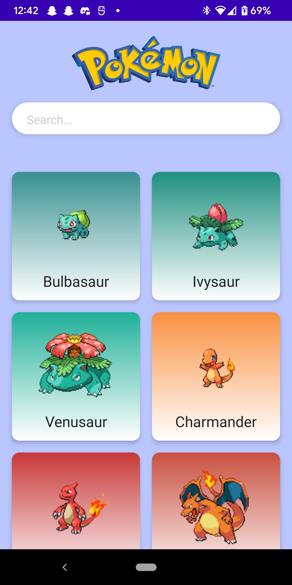
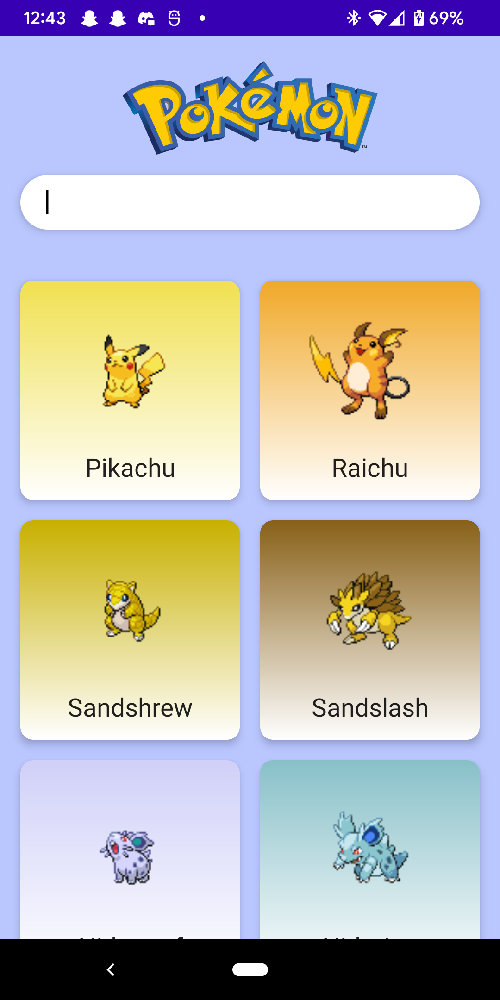
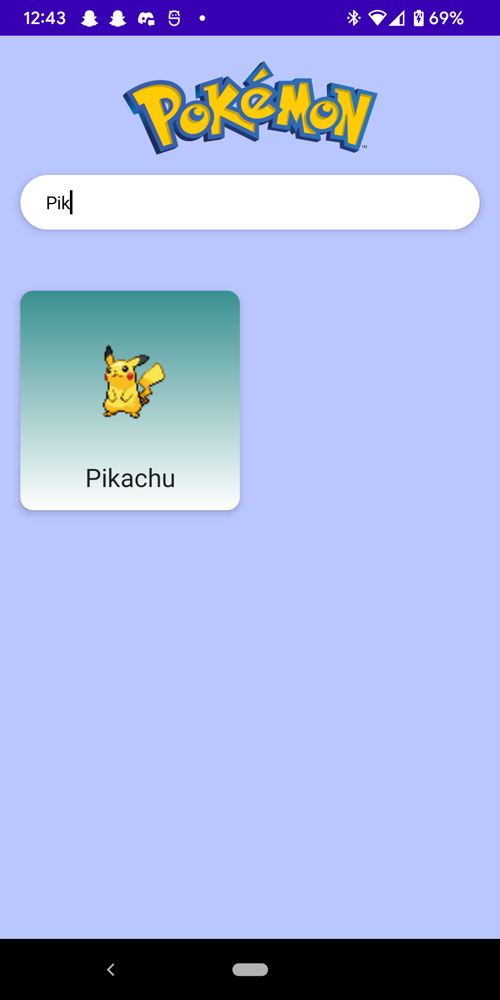
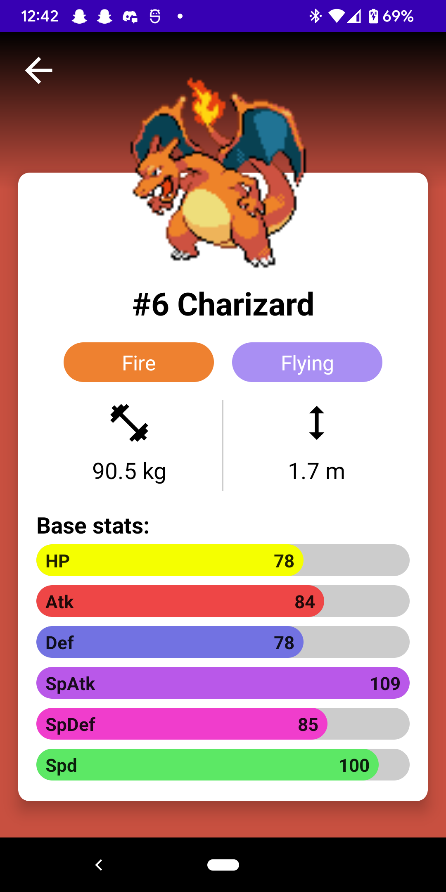

# Mobile-Pokedex

**Author**: Marchael Acode

**Version**: 1.0.0

## Overview

- Android application that displays a list of pokemon throughout multiple generations and gives a basic details of each pokemon.

## ScreenShots

- 

- 

- 

- 

## Credit and Collaboration

- [Philipp Lackner - Podedex App Series](https://www.youtube.com/c/PhilippLackner/videos)
